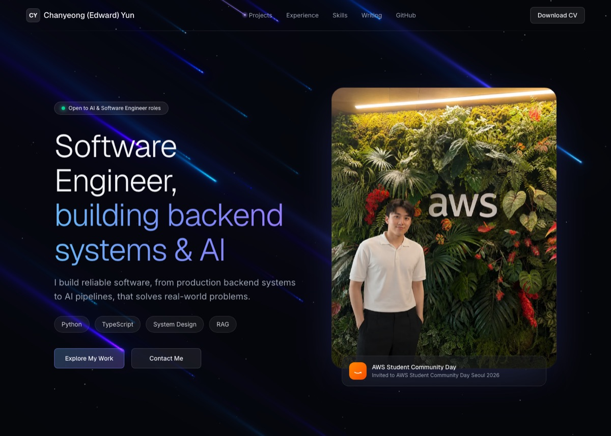

# edwardyun12.github.io

My personal portfolio site — built as a real product, not a template: a full case-study of the RAG system I built at Bespin Global (interactive pipeline explorer, live-tuned retrieval demos), experience, skills, and writing.

**Live: [edwardyun12.github.io](https://edwardyun12.github.io/)**



## Stack

- **React 19 + TypeScript**, built with **Vite**
- **Tailwind CSS v4** for styling
- **Three.js** for the animated hero background
- **oxlint** for linting
- Deployed to **GitHub Pages** via **GitHub Actions** on every push to `main`

## Structure

```
src/
  App.tsx                    # page composition — wires data into sections
  types/portfolio.ts         # shared content types (ExperienceItem, FeaturedProject, ...)
  data/                      # site content — profile, experience, projects, skills, certs, articles, moments
  components/
    ui/starfall-portfolio-landing.tsx   # hero + animated background
    sections/                # one file per page section (Summary, Experience, Projects, ...)
```

Content lives entirely in `src/data/*` as typed data, separate from the section components in `src/components/sections/*` that render it — updating a job, project, or skill means editing a data file, not the layout.

## Development

```bash
npm install
npm run dev      # local dev server
npm run build    # typecheck + production build
npm run lint      # oxlint
```
